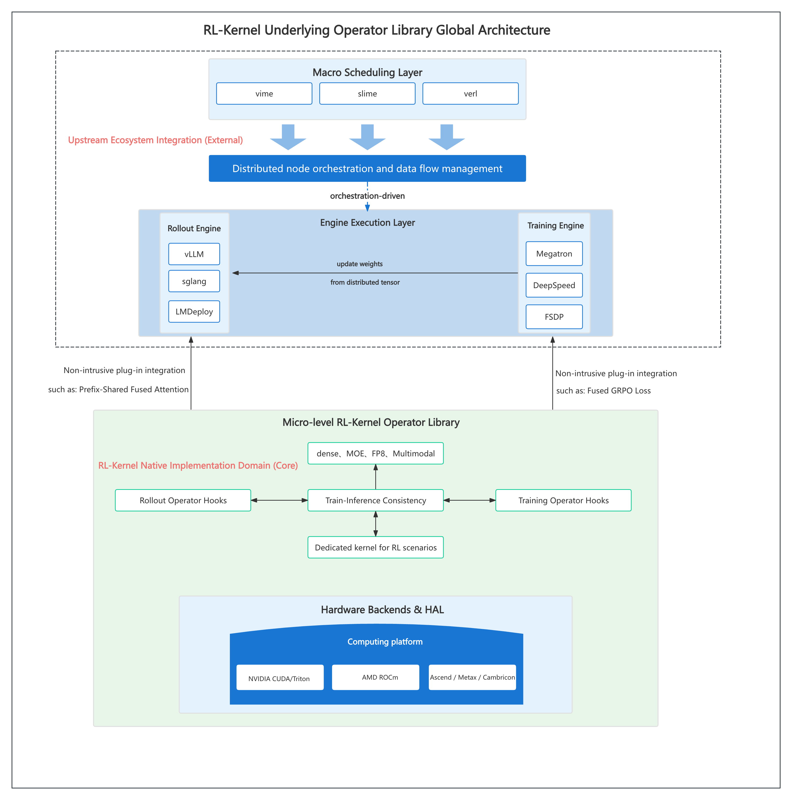
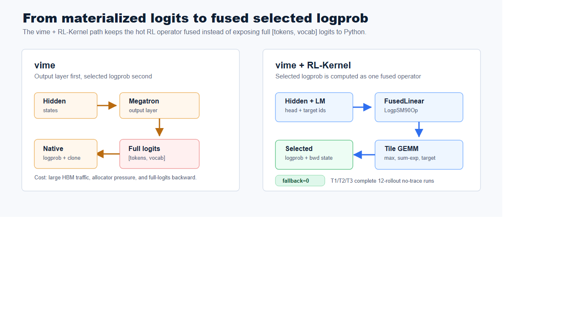
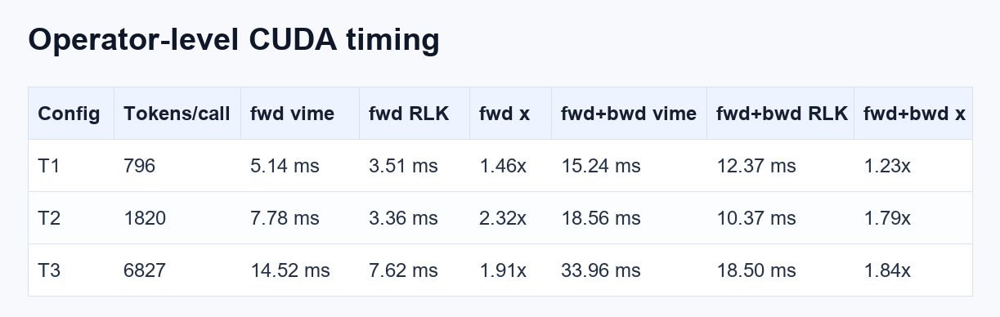
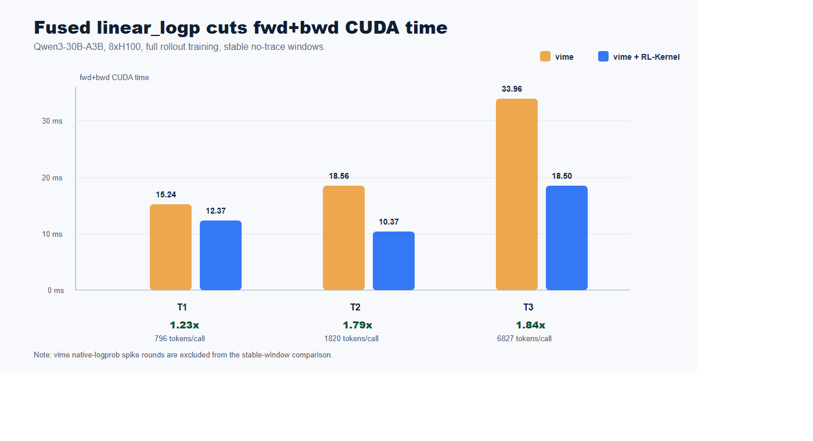
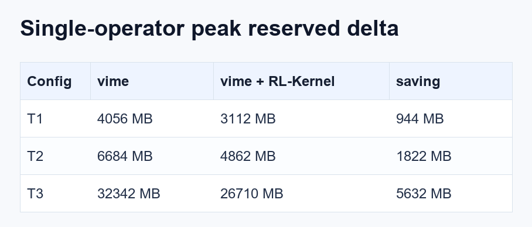
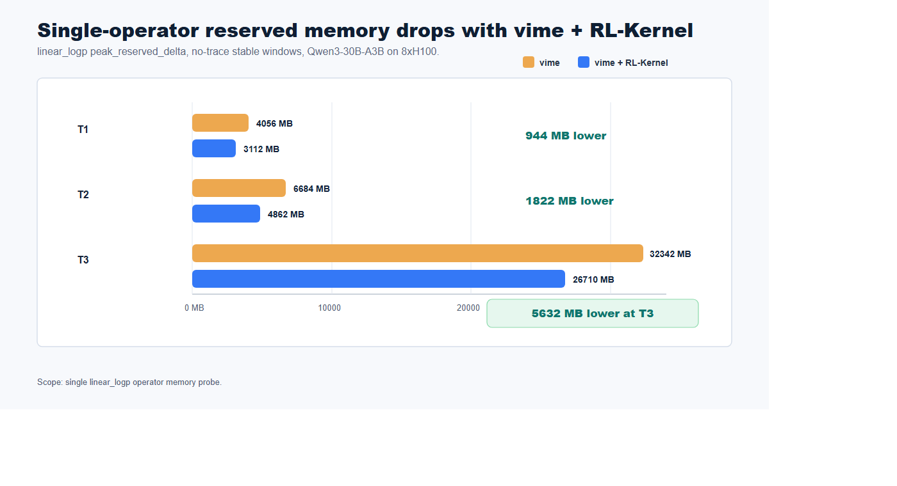
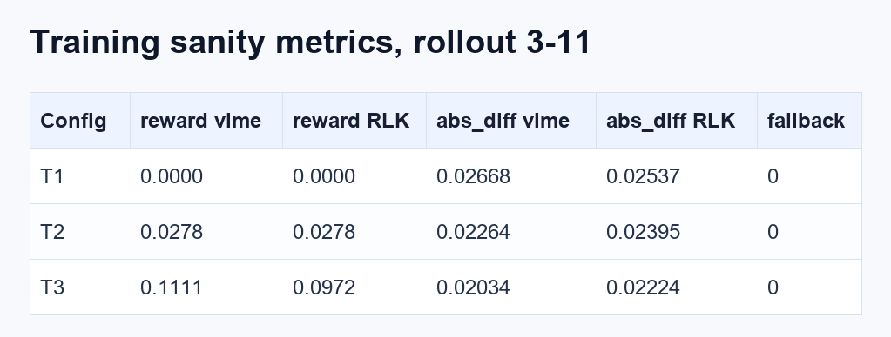

# 发布 vime + RL-Kernel：面向完整 RL Rollout 的更快、更省显存 linear_logp

我们今天介绍 **RL-Kernel** 在 **vime** 中的 `linear_logp` 集成：这是一个面向 LLM RL post-training 的 fused operator path。它用 Hopper 优化的 CUDA 算子替换 vime 原生的 output layer + selected-logprob 路径，直接从 hidden states 和 LM head 权重计算 selected token log probability。

在 Qwen3-30B-A3B、8xH100 80GB、完整 vLLM rollout、Megatron training、TP=2、PP=1、CP=1、EP=8、12 轮 rollout 的设置下，vime + RL-Kernel 在 T1、T2、T3 三组配置中都稳定完成，fallback=0。在最大 no-trace 完整配置中，fused `linear_logp` 的 forward + backward CUDA 时间从 **33.96 ms** 降到 **18.50 ms**，约 **1.84x**；单算子 peak reserved delta 从 **32342 MB** 降到 **26710 MB**。

## 我们的愿景

RL post-training 越来越容易被训练、rollout 和框架层 tensor 物化之间的边界限制。vime 已经提供了清晰的训练和 rollout pipeline，把 Megatron training 与 vLLM generation 连接起来。RL-Kernel 关注的是更底层但同样关键的一层：决定完整 RL step 是否显存敏感、延迟敏感、数值可控的算子。

selected-logprob 路径就是一个典型例子。PPO、GRPO 以及相关算法最终只需要 selected tokens 的 log probabilities，但传统路径往往先物化完整 `[tokens, vocab]` logits，再调用 logprob 工具函数。对于大 vocab 的 MoE 模型，这个中间 tensor 会显著放大 HBM traffic 和 allocator pressure。

RL-Kernel 的目标是让这些 RL 专用算子成为一等基础设施：fused、可观测、tensor-parallel aware，并且可以在不重写上层编排系统的前提下接入生产式训练流程。

## 定位

vime 仍然是 RL framework 和 orchestration layer。它负责训练、rollout、权重同步、数据流以及算法级执行。RL-Kernel 位于其下方，作为 operator library 工作。

在这次集成中，vime 保持原有高层工作流：

- Megatron 负责训练侧。
- vLLM 负责 rollout 侧。
- vime 协调权重更新、样本、reward 和 train-rollout metrics。
- 当后端可用时，RL-Kernel 替换训练侧的 `linear_logp` hot path。

这种集成方式是非侵入式的。如果 fused operator path 没有开启，vime 仍然可以走原生 output layer 和原生 selected-logprob 实现。当 vime + RL-Kernel 命中 fast path 时，训练侧会避免为了 selected-logprob 计算而物化完整 logits。

RL-Kernel 的设计并不是用单一路径覆盖所有场景，而是让 operator path 可观测、可选择：已经验证过形状、硬件和精度组合时，可以走性能优先的 fast path；当任务更强调 rollout-training 一致性时，可以走 consistency-first path。本次实验验证的是 `linear_logp` fast path 在完整 vime 链路中的稳定性和收益，后续工作会在同样可观测的选择/fallback 机制下继续扩大一致性覆盖和性能覆盖。

## 架构概览

RL-Kernel 被设计为高层 RL orchestration 和底层 GPU backend 之间的 operator-layer bridge。它通过 custom operator hooks 接入 rollout engines 和 training engines，真正的 kernel 则由 CUDA、Triton、ROCm 以及相关后端实现。



RL-Kernel 位于 RL orchestration frameworks 和硬件相关 kernel backends 之间的 operator layer。这里使用的是 RL-Kernel README 中的架构图。

对于 `linear_logp`，vime 集成路径如下：

- vime 从 Megatron model 中取出 LM head weight、TP group、本地 vocab 范围以及 global vocab size。
- 在 vime + RL-Kernel 训练侧 forward 中，vime 让 Megatron 返回 hidden states，而不是物化 logits。
- vime 将 hidden states、target token IDs 和 tensor-parallel metadata 传给 RL-Kernel。
- RL-Kernel dispatch `FusedLinearLogpSM90Op`，并命中 fused-tile bf16 full-gradient tensor-parallel fast path。
- CUDA extension 直接计算 selected logprob 和 backward 需要的状态，不把完整 `[tokens, vocab]` logits 暴露给 Python framework layer。



vime 原生路径会物化完整 logits；vime + RL-Kernel 将 selected-logprob 计算融合在 operator layer。

## 核心能力

- **Fused selected-logprob computation**：在 forward 中，RL-Kernel 直接计算 `log_softmax(hidden @ W^T)[target]`，不在 framework layer 物化完整 logits。
- **SM90 tensor-parallel fast path**：完成的 8xH100 run 均命中 Hopper 上的 fused-tile bf16 full-gradient tensor-parallel path。
- **Full-gradient support**：主结果使用 `TRAIN_SCOPE=full`，覆盖相关 hidden 和 weight path，而不是 output-layer-only shortcut。
- **Observable fallback behavior**：每组完成的 vime + RL-Kernel run 都报告 `fallback=0`，确保发布数字来自 fused path。
- **vime-compatible execution**：benchmark 使用完整 vLLM rollout 和 Megatron training，而不是 train-only microbenchmark。

## 验证与 Benchmark

主验证使用 Qwen3-30B-A3B、8xH100 80GB 和完整 rollout training。下面的正式指标都来自完整 12-rollout no-trace run。稳定统计窗口使用 rollout 3-11，避免 warmup 影响。

vime 路径是原生 Megatron output layer + 原生 selected-logprob computation。vime + RL-Kernel 路径是 `FusedLinearLogpSM90Op` 的 `save-logits` fused-tile full-gradient path。

### Qwen3-30B-A3B on 8xH100

T1、T2、T3 中，vime 和 vime + RL-Kernel 都完成了 12 轮 rollout。vime + RL-Kernel run 命中：

```text
Using RL-Kernel linear_logp op: FusedLinearLogpSM90Op
Using fused-tile bf16 full-gradient tensor-parallel linear_logp fast path.
```

并且 `fallback=0`。



最强的单算子结果来自 T3：forward + backward CUDA 时间从 **33.96 ms** 降到 **18.50 ms**。T2 的 forward-only speedup 最高，达到 **2.32x**。



vime + RL-Kernel 在完成的 no-trace 配置中降低了 forward + backward CUDA 时间。

### 单算子显存

显存对比同样使用 operator-level probe。这里统计的是 `linear_logp` 调用窗口内的 peak reserved delta。



T3 是最清晰的单算子显存结果：`linear_logp` operator window 内的 peak reserved delta 从 **32342 MB** 降到 **26710 MB**，节省 **5632 MB**。



显存对比与 timing 对比保持同一口径，都限定在 `linear_logp` 单算子。

### 端到端 Step Time 口径

当前结果主要体现为 `linear_logp` 单算子加速和显存下降。在最大 no-trace 稳定窗口中，full step time 从 **232.20s** 到 **228.40s**，约 **1.6%** 小幅改善；同一窗口里，full-run peak reserved 从 **49.26GB** 降到 **46.23GB**，减少约 **3.03GB**。

由于完整 RL step 还包含 rollout、weight sync、TP/NCCL 通信和框架调度，我们不将本轮结果 claim 为显著 end-to-end step speedup。这是 vime + RL-Kernel 的第一阶段集成，后续会继续扩展到更多 RL hot path 和 communication-aware / TP-aware 算子，并补充更多端到端实验。

### 稳定性与健康信号

完成的 vime + RL-Kernel runs 保持了预期训练信号。loss 为 finite，reward 与 vime 同量级，train-rollout logprob difference 也保持在同一量级。



表中沿用本文统一的 rollout 3-11 稳定窗口，关注可复现的单算子行为。

## 为什么 Fused Path 有收益

vime 原生路径是两段式：

```text
hidden -> output_layer -> full logits -> selected logprob
```

vime + RL-Kernel 改变了 operator boundary：

```text
hidden + lm_head_weight + target_ids -> selected logprob
```

这个变化有四点收益。

第一，vime + RL-Kernel 不再把完整 `[tokens, vocab]` logits 暴露为 framework-level forward intermediate。T3 中每次 call 覆盖约 6.8k packed tokens，因此移除这个 framework-level logits tensor 可以显著减少 memory traffic 和 allocator pressure。

第二，CUDA kernel 可以在 tiled GEMM 过程中同时维护 max、sum-exp 和 target-logit statistics，而不是等完整 logits matrix 生成后再进入 logprob 计算。

第三，tensor-parallel metadata 是显式的。RL-Kernel 接收 TP group、本地 vocab start index 和 global vocab size，使每个 rank 在本地 vocab shard 上工作，只合并 global selected logprob 所需的统计量。

第四，full-gradient backward 也进入更快的路径。RL-Kernel 在 CUDA/C++ 中组织 local/tiled logits/dlogits 和 linear-gradient 计算，用受控的 workspace 换取更少的 Python chunk loop、更少的小 matmul dispatch 和更低的 allocator 抖动。这个设计主要服务 latency；在实测的单算子窗口里，它的 peak reserved memory 仍然低于 vime 路径。

## 后续工作

RL-Kernel 和 vime 后续会沿着几个实际方向继续演进：

- **Train-inference consistency first**：我们会优先考虑算子层面的训推一致，在保证训推一致的前提下，把算子性能提升到极致。
- **Observable path selection**：继续完善 fast path、consistency-first path 和原生 fallback 之间的选择机制，让不同任务可以在性能、覆盖范围和训推一致性之间做清晰取舍。
- **Deeper vime integration**：改进 operator selection、fallback visibility、timing counters 和长跑任务中的 weight-sync instrumentation。
- **More RL-specific kernels**：把 fused 和 memory-efficient path 从 `linear_logp` 扩展到更多 GRPO、PPO、DPO、attention、sampling 和 MoE hot spots。
- **Broader hardware coverage**：继续完善 CUDA path，同时扩展 Triton 和 ROCm backends，让同一套 operator-level API 服务更多 accelerator environments。

## 快速开始

8xH100 benchmark 入口如下：

```bash
cd /workspace/vime
WORKSPACE_ROOT=/workspace \
VIME_PYTHON_ENV=/workspace/vime-rlk-env \
TRACE_MODE=none \
TRAIN_SCOPE=full \
scripts/benchmarks/run-qwen3-30B-A3B-8gpu-rlk-12rollout.sh T3 cuda
```

vime + RL-Kernel 的关键设置：

```bash
export VIME_RL_KERNEL=1
export VIME_RL_KERNEL_OPS=linear_logp
export VIME_RL_KERNEL_LINEAR_LOGP_BACKEND=cuda
export VIME_RL_KERNEL_CUDA_EVENT_TIMER=1
export VIME_RL_KERNEL_LINEAR_LOGP_DETACH_HIDDEN=0
export RL_KERNEL_LINEAR_LOGP_SAVE_PROBS_BF16=0
export RL_KERNEL_LINEAR_LOGP_FUSED_TILE_BWD_FULL=1
```

采集数据前，需要确认 RL-Kernel CUDA extension 暴露 SM90 forward/backward 符号，并在日志中确认 vime + RL-Kernel 命中 fused-tile fast path 且 `fallback=0`。

## 加入社区

RL-Kernel 是开源的 RL post-training operator infrastructure 项目。

- **RL-Kernel code and docs**：[github.com/RL-Align/RL-Kernel](https://github.com/RL-Align/RL-Kernel)
- **vime code and docs**：[github.com/vllm-project/vime](https://github.com/vllm-project/vime)
- **Feedback**：欢迎提交 issue、PR、benchmark 结果和硬件报告。

如果你的大规模 RL post-training 任务遇到 selected-logprob 或 output-layer 显存压力，RL-Kernel 是一个值得优先检查的位置。

## 致谢

这项工作建立在 vime、vLLM、Megatron-LM、FlashInfer、DeepSpeed 以及更广泛的开源 RL infrastructure ecosystem 之上。感谢 vime 和 RL-Kernel contributors 在 8xH100 长跑验证、rollout 与 weight-sync path 调试、以及完整 no-trace benchmark 口径整理中的工作。
